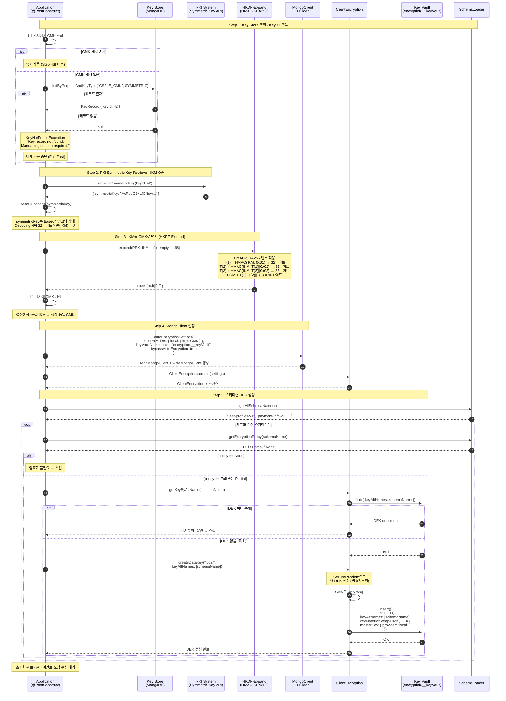

* TOC
{:toc}

## Symmetric Encryption Fundamentals

***[AES(Advanced Encryption Standard)](https://en.wikipedia.org/wiki/Advanced_Encryption_Standard)*** 는 2001년 NIST(National Institute of Standards and Technology)가 FIPS 197로 표준화한 대칭키 블록 암호 알고리즘이다. 벨기에 암호학자 Joan Daemen과 Vincent Rijmen이 설계한 ***Rijndael*** 알고리즘을 기반으로 한다.

대칭키 암호(Symmetric Encryption)는 암호화와 복호화에 동일한 키를 사용하는 방식이다. 비대칭키 암호(RSA 등)와 비교하면 연산 속도가 빠르기 때문에, 대량의 데이터를 암호화해야 하는 데이터베이스 필드 암호화에 적합하다.

### AES: Advanced Encryption Standard

AES 는 세 가지 키 길이를 지원한다:

| Key Size | Rounds | Security Level |
|----------|--------|----------------|
| AES-128 | 10 | 128-bit |
| AES-192 | 12 | 192-bit |
| AES-256 | 14 | 256-bit |

여기서 Round 는 치환(SubBytes), 행 이동(ShiftRows), 열 혼합(MixColumns), 라운드 키 더하기(AddRoundKey) 등의 변환을 반복 적용하는 횟수를 의미한다. 키 길이가 길수록 라운드 수가 증가하고, 그만큼 Brute-force 공격에 대한 내성이 높아진다.

데이터베이스 필드 암호화에는 AES-256이 사실상 표준이다. 

### Block Cipher and Stream Cipher

***Block Cipher*** 는 고정 크기 블록(AES의 경우 128-bit = 16바이트) 단위로 암호화를 수행한다. 평문을 블록 단위로 분할하고, 각 블록에 동일한 암호화 함수를 적용한다.

***Stream Cipher*** 는 평문을 비트 또는 바이트 단위로 키 스트림(Key Stream)과 XOR하여 암호화한다. ChaCha20이 대표적이다.

| 특성 | Block Cipher | Stream Cipher |
|------|-------------|---------------|
| 처리 단위 | 고정 크기 블록 (e.g., 128-bit) | 비트/바이트 단위 |
| Padding 필요 여부 | 필요 (평문이 블록 크기의 배수가 아닌 경우) | 불필요 |
| 대표 알고리즘 | AES, DES, 3DES | ChaCha20, RC4 |
| 데이터베이스 암호화 | 주로 사용 | 드물게 사용 |

데이터베이스 필드 암호화에서는 Block Cipher인 AES가 주로 사용된다. 이유는 구조화된 데이터(문자열, 숫자 등)의 길이가 비교적 예측 가능하고, 블록 단위 처리가 하드웨어 가속(AES-NI)과 호환되기 때문이다.

---

## Block Cipher Modes of Operation

Block Cipher 는 단일 블록만 암호화하는 함수이다. 실제 데이터는 대부분 단일 블록보다 크기 때문에, 여러 블록을 어떻게 처리할지를 정의하는 것이 ***[Block Cipher Mode of Operation](https://en.wikipedia.org/wiki/Block_cipher_mode_of_operation)*** 이다.

### ECB: Electronic Codebook Mode

***ECB(Electronic Codebook)*** 는 가장 단순한 모드로, 각 블록을 독립적으로 암호화한다.

ECB 의 치명적 결함은 **동일한 평문 블록이 항상 동일한 암호문 블록으로 변환**된다는 것이다. 예를 들어 "주민등록번호 앞 6자리"처럼 동일한 값이 반복되는 데이터에서 패턴이 그대로 노출된다. ECB 모드로 이미지를 암호화하면 윤곽선이 그대로 남는 유명한 "ECB Penguin" 사례가 이를 잘 보여준다.

<mark><em><strong>ECB 모드는 데이터베이스 암호화에 절대 사용해서는 안 된다. 동일 평문이 동일 암호문을 생성하므로 패턴 분석 공격에 취약하다.</strong></em></mark>

### CBC: Cipher Block Chaining Mode

***[CBC(Cipher Block Chaining)](https://en.wikipedia.org/wiki/Block_cipher_mode_of_operation#Cipher_block_chaining_(CBC))*** 는 각 블록을 암호화하기 전에, 이전 블록의 암호문과 현재 블록의 평문을 XOR 연산한다.

```
IV ──────────────┐
                  ↓
Plaintext[0] → [XOR] → [AES-Enc] → Ciphertext[0]
                                         │
                  ┌──────────────────────┘
                  ↓
Plaintext[1] → [XOR] → [AES-Enc] → Ciphertext[1]
                                         │
                  ┌──────────────────────┘
                  ↓
Plaintext[2] → [XOR] → [AES-Enc] → Ciphertext[2]
```

__핵심 동작 원리:__

$$C_i = E_K(P_i \oplus C_{i-1}), \quad C_0 = IV$$

- $$P_i$$ : i번째 평문 블록
- $$C_i$$ : i번째 암호문 블록
- $$E_K$$ : 키 K를 사용한 AES 암호화 함수
- $$\oplus$$ : XOR 연산

첫 번째 블록에는 이전 암호문이 없으므로 ***IV(Initialization Vector)*** 가 그 역할을 대신한다. CBC 모드에서는 동일한 평문이라도 IV가 다르면 완전히 다른 암호문이 생성된다. 이것이 ECB와의 근본적인 차이다.

### ECB vs CBC Comparison

```
┌─────────────────────────────────────────────────────────────────────┐
│                      ECB Mode (INSECURE)                            │
├─────────────────────────────────────────────────────────────────────┤
│                                                                     │
│  Plaintext:   [ Block 1 ]    [ Block 2 ]    [ Block 3 ]            │
│                   │              │              │                   │
│                   ▼              ▼              ▼                   │
│              ┌─────────┐   ┌─────────┐   ┌─────────┐              │
│              │ AES(K)  │   │ AES(K)  │   │ AES(K)  │              │
│              └─────────┘   └─────────┘   └─────────┘              │
│                   │              │              │                   │
│                   ▼              ▼              ▼                   │
│  Ciphertext: [ Cipher 1 ]  [ Cipher 2 ]  [ Cipher 3 ]             │
│                                                                     │
│  Problem: Block 1 == Block 2  =>  Cipher 1 == Cipher 2             │
│           (Pattern Preserved!)                                      │
└─────────────────────────────────────────────────────────────────────┘

┌─────────────────────────────────────────────────────────────────────┐
│                       CBC Mode (SECURE)                             │
├─────────────────────────────────────────────────────────────────────┤
│                                                                     │
│  Plaintext:   [ Block 1 ]    [ Block 2 ]    [ Block 3 ]            │
│                   │              │              │                   │
│       IV ──► XOR ─┘    ┌──► XOR ─┘    ┌──► XOR ─┘                 │
│                   │    │         │    │         │                   │
│                   ▼    │         ▼    │         ▼                   │
│              ┌─────────┐   ┌─────────┐   ┌─────────┐              │
│              │ AES(K)  │   │ AES(K)  │   │ AES(K)  │              │
│              └─────────┘   └─────────┘   └─────────┘              │
│                   │    │         │    │         │                   │
│                   ▼    │         ▼    │         ▼                   │
│  Ciphertext: [ Cipher 1 ]──┘ [ Cipher 2 ]──┘ [ Cipher 3 ]        │
│                                                                     │
│  Block 1 == Block 2  =>  Cipher 1 != Cipher 2                      │
│  (Pattern Destroyed by Chaining)                                    │
└─────────────────────────────────────────────────────────────────────┘
```

| Mode | 병렬 암호화 | 인증 기능 | 주요 용도 |
|------|------------|----------|----------|
| CBC | 불가 | 없음 | 데이터베이스 필드 암호화, 레거시 시스템 |
| CTR | 가능 | 없음 | 스트리밍 암호화 |
| GCM | 가능 | 있음 (AEAD) | TLS 1.3, API 통신 |

---

## Initialization Vector

***[IV(Initialization Vector)](https://en.wikipedia.org/wiki/Initialization_vector)*** 는 블록 암호의 첫 번째 블록에 사용되는 초기 입력값이다.

### Why IV Must Be Unpredictable

IV의 핵심 목적은 **동일한 평문을 동일한 키로 암호화하더라도 매번 다른 암호문을 생성**하는 것이다. 이를 ***Semantic Security*** 라고 한다.

__Scenario 1__: IV 없이 동일한 키로 동일한 평문을 암호화

```
"홍길동" + Key → 항상 "x7Kp9Q..."
"홍길동" + Key → 항상 "x7Kp9Q..."  ← 동일한 암호문!
```

__Scenario 2__: IV를 사용하여 동일한 키로 동일한 평문을 암호화

```
"홍길동" + Key + IV_1 → "x7Kp9Q..."
"홍길동" + Key + IV_2 → "mN3bRf..."  ← 다른 암호문!
```

IV는 다음 조건을 충족해야 한다:

1. **예측 불가능(Unpredictable)**: CBC 모드에서는 IV가 예측 가능하면 ***[Chosen-Plaintext Attack](https://en.wikipedia.org/wiki/Chosen-plaintext_attack)*** 에 취약해진다(BEAST 공격이 대표적).
2. **고유성(Unique)**: 동일한 키로 암호화할 때 IV가 재사용되면 안 된다. CBC에서 IV를 재사용하면 첫 블록에서 동일성 패턴이 노출되어 의미적 안전성이 깨진다(특히 chosen-plaintext 환경에서 위험). 따라서 IV는 매 암호화마다 새로 생성해야 한다.
3. **크기**: AES에서 IV의 크기는 블록 크기와 동일한 128-bit(16바이트)이다.

### IV in CBC Mode

IV는 ***[CSPRNG(Cryptographically Secure Pseudo-Random Number Generator)](https://en.wikipedia.org/wiki/Cryptographically_secure_pseudorandom_number_generator)*** 로 생성해야 한다. Java/Kotlin에서는 `java.security.SecureRandom`을 사용한다.

```kotlin
import java.security.SecureRandom

fun generateIV(): ByteArray {
    val iv = ByteArray(16) // AES block size = 128-bit = 16 bytes
    SecureRandom().nextBytes(iv)
    return iv
}
```

`SecureRandom`은 시스템 엔트로피 소스(e.g., Linux의 `/dev/urandom`)에서 ***Seed*** 를 획득하여 내부 PRNG 상태를 초기화한다. Seed의 품질이 생성되는 난수의 보안 강도를 결정하므로, 암호학적 용도에서는 반드시 운영체제가 제공하는 엔트로피 소스를 사용해야 한다.

IV는 비밀이 아니다. IV의 보안 요구사항은 비밀성(Confidentiality)이 아니라 고유성(Uniqueness)과 예측 불가능성(Unpredictability)이다.

따라서 일반적으로 **암호문 앞에 IV를 연결(prepend)하여 함께 저장**한다:

```
[IV (16 bytes)] + [Ciphertext (N bytes)]
```

복호화 시 앞 16바이트를 IV로 분리하고, 나머지를 암호문으로 사용한다.

## Padding

### PKCS5 vs PKCS7 Padding

Block Cipher는 고정 크기 블록 단위로 동작한다. AES의 블록 크기는 128-bit(16바이트)이므로, 평문의 길이가 16바이트의 배수가 아닌 경우 마지막 블록을 채울 ***Padding*** 이 필요하다.

예를 들어 평문이 20바이트인 경우:

```
|  Block 1 (16 bytes)  |  Block 2 (4 bytes + 12 bytes padding)  |
```

***[PKCS#7](https://datatracker.ietf.org/doc/html/rfc5652#section-6.3)*** Padding은 부족한 바이트 수만큼의 값을 패딩으로 채운다:

```
패딩 필요 바이트 수 = BlockSize - (DataLength % BlockSize)

예시 (블록 크기 16바이트, 데이터 11바이트):
  패딩 필요: 16 - 11 = 5
  패딩 값: 0x05 0x05 0x05 0x05 0x05

예시 (데이터가 정확히 16바이트):
  패딩 필요: 16 (새 블록 전체를 패딩으로 추가)
  패딩 값: 0x10 0x10 ... 0x10 (16바이트)
```

***PKCS#5*** 는 PKCS#7의 부분집합이다. PKCS#5는 8바이트 블록에만 적용되도록 정의되었고(DES 용), PKCS#7은 1~255바이트 블록을 지원한다. AES는 16바이트 블록이므로 엄밀히는 PKCS#7이 맞지만, Java의 `Cipher` API에서는 `"PKCS5Padding"`이라는 이름으로 실제 PKCS#7 동작을 수행한다. 이는 역사적 관례이다.

| 표준 | 블록 크기 | 비고 |
|------|----------|------|
| PKCS#5 | 8바이트만 | DES 용으로 정의 |
| PKCS#7 | 1~255바이트 | AES 등 다양한 블록 크기 지원 |

### Padding Oracle Attack

***[Padding Oracle Attack](https://en.wikipedia.org/wiki/Padding_oracle_attack)*** 은 서버가 패딩 오류 여부를 응답으로 알려줄 때 발생하는 공격이다. 공격자가 암호문을 변조하여 서버에 전송하고, "패딩 유효/무효" 응답을 관찰하면 바이트 단위로 평문을 복원할 수 있다.

__대응 방법:__

- 패딩 오류와 복호화 오류를 구분하지 않는 일관된 에러 응답 반환
- CBC 대신 AEAD 모드(GCM) 사용으로 무결성 검증 동시 수행
- ***Encrypt-then-MAC*** 패턴 적용 (암호문에 대해 HMAC을 계산하여, 복호화 전에 무결성을 먼저 검증)

## AES-256-CBC Encryption and Decryption

AES-256-CBC 방식으로 데이터를 암호화/복호화하는 전체 흐름을 코드로 표현하면 다음과 같다.

```kotlin
import javax.crypto.Cipher
import javax.crypto.spec.IvParameterSpec
import javax.crypto.spec.SecretKeySpec
import java.security.SecureRandom
import java.util.Base64

object AesCbcCipher {
    private const val ALGORITHM = "AES"
    private const val TRANSFORMATION = "AES/CBC/PKCS5Padding" // 실제로는 PKCS#7 동작
    private const val IV_LENGTH = 16

    /**
     * AES-256-CBC 암호화
     * @param plaintext 평문
     * @param key 256-bit (32바이트) 대칭키
     * @return Base64 인코딩된 [IV + Ciphertext]
     */
    fun encrypt(plaintext: String, key: ByteArray): String {
        require(key.size == 32) { "AES-256 requires a 32-byte key" }

        val iv = ByteArray(IV_LENGTH)
        SecureRandom().nextBytes(iv)

        val cipher = Cipher.getInstance(TRANSFORMATION)
        cipher.init(Cipher.ENCRYPT_MODE, SecretKeySpec(key, ALGORITHM), IvParameterSpec(iv))
        val ciphertext = cipher.doFinal(plaintext.toByteArray(Charsets.UTF_8))

        // IV를 암호문 앞에 연결하여 저장
        val combined = iv + ciphertext
        return Base64.getEncoder().encodeToString(combined)
    }

    /**
     * AES-256-CBC 복호화
     * @param encoded Base64 인코딩된 [IV + Ciphertext]
     * @param key 256-bit (32바이트) 대칭키
     * @return 복호화된 평문
     */
    fun decrypt(encoded: String, key: ByteArray): String {
        require(key.size == 32) { "AES-256 requires a 32-byte key" }

        val combined = Base64.getDecoder().decode(encoded)
        val iv = combined.copyOfRange(0, IV_LENGTH)
        val ciphertext = combined.copyOfRange(IV_LENGTH, combined.size)

        val cipher = Cipher.getInstance(TRANSFORMATION)
        cipher.init(Cipher.DECRYPT_MODE, SecretKeySpec(key, ALGORITHM), IvParameterSpec(iv))
        return String(cipher.doFinal(ciphertext), Charsets.UTF_8)
    }
}
```

__핵심 포인트:__

1. IV는 매 암호화마다 `SecureRandom`으로 새로 생성한다
2. IV는 암호문 앞에 연결(prepend)하여 하나의 값으로 저장한다
3. `"AES/CBC/PKCS5Padding"`은 Java의 관례적 이름이며, 실제로는 PKCS#7 패딩이 적용된다
4. 키는 반드시 32바이트(256-bit)여야 한다

> AES-CBC는 ***기밀성(Confidentiality)*** 만 제공하며, 무결성(Integrity)과 인증(Authenticity)을 보장하지 않는다. 따라서 **CBC 단독 사용은 Padding Oracle Attack 등에 취약**하다. 실무에서는 ***AEAD(Authenticated Encryption with Associated Data)*** 모드인 AES-GCM을 우선 사용하고, 불가피하게 CBC를 사용해야 하는 경우 ***Encrypt-then-MAC*** 을 적용하여 암호문에 대한 HMAC을 먼저 검증해야 한다.

## Key Derivation Functions

***Key Derivation Function(KDF)*** 는 제한된 엔트로피의 원본 키 또는 패스워드를 암호학적으로 강력한 키로 변환하는 함수이다.

### PBKDF2: Password-Based Key Derivation

***[PBKDF2(Password-Based Key Derivation Function 2)](https://en.wikipedia.org/wiki/PBKDF2)*** 는 반복(iteration) 기반으로 Brute-force 비용을 증가시킨다. 패스워드 해싱에 적합하며, [Password Encryption](https://klarciel.net/wiki/crypto/crypto-password-encryption/)에서 자세히 다루었다.

### Argon2: Memory-Hard Password Hashing

***[Argon2](https://en.wikipedia.org/wiki/Argon2)*** 는 2015년 Password Hashing Competition(PHC)의 우승 알고리즘이다. PBKDF2와 달리 메모리 사용량을 조절할 수 있어 GPU/ASIC 기반 Brute-force 공격에 더 강한 내성을 갖는다. Argon2id 변형은 Side-channel 공격과 GPU 공격 모두에 대응하며, OWASP는 신규 시스템에서 Argon2id를 권장한다.

| 특성 | PBKDF2 | Argon2 |
|------|--------|--------|
| 공격 내성 | CPU 기반 | CPU + Memory 기반 (Memory-Hard) |
| GPU 공격 내성 | 낮음 | 높음 |
| 표준 | RFC 8018 | RFC 9106 |
| 주요 용도 | 레거시 시스템 호환 | 신규 패스워드 해싱 권장 |

패스워드 해싱에 대한 자세한 내용은 [Password Encryption](https://klarciel.net/wiki/crypto/crypto-password-encryption/)에서 다루었다.

### HKDF: HMAC-Based Extract-and-Expand Key Derivation Function

***[HKDF(HMAC-based Extract-and-Expand Key Derivation Function)](https://datatracker.ietf.org/doc/html/rfc5869)*** 는 RFC 5869에서 정의한 키 유도 함수(KDF)이다. 제한된 입력 키 자료(IKM, Input Keying Material)로부터 강력한 암호화 키를 생성하는 데 사용된다.

#### HKDF-Extract

$$PRK = \text{HMAC-Hash}(salt, IKM)$$

- ***IKM(Input Keying Material)***: 입력 키 자료. 예를 들어 PKI 시스템에서 발급받은 대칭키
- ***salt***: 선택적 비밀이 아닌 랜덤 값. HMAC의 키로 사용된다
- ***PRK(Pseudorandom Key)***: 추출된 의사 난수 키. HMAC의 출력 크기와 동일 (SHA-256의 경우 32바이트)

salt를 사용하면 입력 자료의 엔트로피가 불균일하더라도 PRK의 분포가 균일해진다. salt가 없으면 Hash 길이만큼의 0으로 채운 바이트 배열을 사용한다(RFC 5869 Section 2.2).

#### HKDF-Expand

$$T(0) = \text{empty string}$$

$$T(i) = \text{HMAC-Hash}(PRK, T(i-1) \| \text{info} \| i)$$

$$OKM = \text{first } L \text{ bytes of } T(1) \| T(2) \| \cdots$$

- ***info***: 컨텍스트 정보 (e.g., 용도 식별자, 프로토콜 라벨)
- ***L***: 출력 키 길이 (OKM의 바이트 수)
- ***OKM(Output Keying Material)***: 최종 유도된 키

```
┌─────────────────────────────────────────────────────────────────┐
│                  HKDF: Extract-and-Expand                       │
├─────────────────────────────────────────────────────────────────┤
│                                                                 │
│  ┌──── Phase 1: Extract ────────────────────────────────────┐   │
│  │                                                          │   │
│  │   Salt (optional)     IKM (Input Keying Material)        │   │
│  │        │                    │                            │   │
│  │        └──────┬─────────────┘                            │   │
│  │               ▼                                          │   │
│  │        ┌─────────────┐                                   │   │
│  │        │ HMAC-Hash   │                                   │   │
│  │        └─────────────┘                                   │   │
│  │               │                                          │   │
│  │               ▼                                          │   │
│  │      PRK (Pseudorandom Key)                              │   │
│  │      (fixed length, e.g. 32 bytes for SHA-256)           │   │
│  └──────────────────────────────────────────────────────────┘   │
│                  │                                              │
│                  ▼                                              │
│  ┌──── Phase 2: Expand ─────────────────────────────────────┐   │
│  │                                                          │   │
│  │   PRK          info (context)       counter              │   │
│  │    │                │                  │                  │   │
│  │    │   ┌────────────┼──────────────────┘                  │   │
│  │    │   │            │                                     │   │
│  │    ▼   ▼            ▼                                     │   │
│  │   HMAC(PRK, info || 0x01)           → T(1) = 32 bytes    │   │
│  │   HMAC(PRK, T(1) || info || 0x02)   → T(2) = 32 bytes    │   │
│  │   HMAC(PRK, T(2) || info || 0x03)   → T(3) = 32 bytes    │   │
│  │                                                          │   │
│  │   OKM = T(1) || T(2) || T(3) || ...                      │   │
│  │   (truncated to desired length)                           │   │
│  └──────────────────────────────────────────────────────────┘   │
│                                                                 │
│  Example: IKM (32 bytes) → OKM (96 bytes for MongoDB CMK)      │
└─────────────────────────────────────────────────────────────────┘
```

| Parameter | 설명 | 필수 여부 |
|-----------|------|----------|
| IKM | 입력 키 자료 | 필수 |
| salt | 비밀이 아닌 랜덤 값 (Extract 단계의 HMAC 키) | 선택 (권장) |
| info | 컨텍스트/용도 식별 문자열 | 선택 |
| L | 출력 키 길이 (바이트) | 필수 |

<mark><em><strong>HKDF는 결정론적(Deterministic)이다. 동일한 IKM, salt, info, L을 입력하면 항상 동일한 OKM이 출력된다. 이 성질 덕분에 키를 저장하지 않고도, 동일한 입력 자료만 있으면 언제든지 동일한 키를 재생성할 수 있다.</strong></em></mark>

이는 데이터베이스 암호화 아키텍처에서 중요한 의미를 갖는다. PKI 시스템에서 발급한 대칭키(IKM)가 동일하면 애플리케이션을 재시작하더라도 항상 동일한 CMK(Customer Master Key)를 생성할 수 있으므로, 기존에 암호화된 데이터의 복호화가 보장된다.

참고로 후술할 PKI 연동 아키텍처에서는 HKDF-Extract 단계를 생략하고 HKDF-Expand만 사용한다. PKI 시스템에서 발급한 대칭키가 이미 충분한 엔트로피를 가진 암호학적으로 강력한 키이므로, RFC 5869 Section 3.3에 따라 Extract 단계를 생략할 수 있다(HKDF-Expand-only mode).

### HKDF-Expand Implementation

```kotlin
import javax.crypto.Mac
import javax.crypto.spec.SecretKeySpec

/**
 * HKDF-Expand 구현 개념 (RFC 5869 Section 2.3)
 *
 * @param prk Pseudorandom Key (Extract 단계의 출력)
 * @param info 컨텍스트 정보
 * @param length 출력 키 길이 (바이트)
 * @return Output Keying Material (OKM)
 */
fun hkdfExpand(prk: ByteArray, info: ByteArray, length: Int): ByteArray {
    val hmac = Mac.getInstance("HmacSHA256")
    hmac.init(SecretKeySpec(prk, "HmacSHA256"))

    val hashLen = 32 // SHA-256 출력 크기
    val n = (length + hashLen - 1) / hashLen // 필요한 반복 횟수 (올림)
    require(n <= 255) { "Output length exceeds maximum (255 * HashLen)" }

    val okm = ByteArray(length)
    var prev = ByteArray(0)
    var offset = 0

    for (i in 1..n) {
        hmac.reset()
        hmac.update(prev)           // T(i-1)
        hmac.update(info)           // info
        hmac.update(i.toByte())     // counter (1-byte)
        prev = hmac.doFinal()

        val copyLen = minOf(hashLen, length - offset)
        System.arraycopy(prev, 0, okm, offset, copyLen)
        offset += copyLen
    }

    return okm
}
```

SHA-256 기반 HKDF-Expand의 경우, 한 라운드에 32바이트를 생성한다. 따라서 96바이트 키가 필요하면 3라운드(32 x 3 = 96)를 수행한다.

### HKDF in TLS 1.3

TLS 1.3(RFC 8446)에서는 HKDF를 핵심 키 유도 메커니즘으로 사용한다. Handshake 과정에서 공유된 비밀(Shared Secret)로부터 다양한 키(Handshake Traffic Key, Application Traffic Key 등)를 유도할 때 HKDF-Extract와 HKDF-Expand를 반복 적용한다.

## HMAC: Hash-Based Message Authentication Code

***[HMAC(Hash-based Message Authentication Code)](https://en.wikipedia.org/wiki/HMAC)*** 은 RFC 2104에서 정의한 메시지 인증 코드이다. 해시 함수와 비밀 키를 결합하여 메시지의 ***무결성(Integrity)*** 과 ***인증(Authenticity)*** 을 동시에 보장한다.

### SHA-1 and SHA-256

| 특성 | SHA-1 | SHA-256 |
|------|-------|---------|
| 출력 크기 | 160-bit (20바이트) | 256-bit (32바이트) |
| 충돌 저항성 | **취약** (2017년 Google의 SHAttered 프로젝트에서 충돌 발견) | 안전 |
| NIST 권고 | 사용 금지 (deprecated since 2011) | 권장 |
| 성능 | 약간 빠름 | SHA-1 대비 약간 느림 |

SHA-1은 2017년에 충돌(Collision)이 발견되어 사실상 폐기된 알고리즘이다. 새로운 시스템에서는 반드시 SHA-256 이상을 사용해야 한다.

### HMAC Structure

HMAC의 정의는 다음과 같다:

$$\text{HMAC}(K, m) = H\big((K' \oplus opad) \| H((K' \oplus ipad) \| m)\big)$$

- $$K$$: 비밀 키
- $$K'$$: 키를 해시 함수의 블록 크기에 맞게 조정한 값 (짧으면 0으로 패딩, 길면 해싱)
- $$opad$$: Outer Padding (0x5c를 블록 크기만큼 반복)
- $$ipad$$: Inner Padding (0x36을 블록 크기만큼 반복)
- $$H$$: 해시 함수 (SHA-256 등)
- $$m$$: 메시지
- $$\|$$: 연결(concatenation)
- $$\oplus$$: XOR 연산

```
Inner Hash:  H((K' ⊕ ipad) || message)
                          ↓
Outer Hash:  H((K' ⊕ opad) || inner_hash)
                          ↓
                        HMAC
```

이중 해시 구조를 사용하는 이유는 단순히 `H(K || m)` 형태를 사용하면 ***[Length Extension Attack](https://en.wikipedia.org/wiki/Length_extension_attack)*** 에 취약하기 때문이다. Merkle-Damgard 구조의 해시 함수(SHA-1, SHA-256 등)는 내부 상태가 출력에 그대로 반영되어, H(K || m)의 결과를 알면 K를 모르더라도 H(K || m || m')을 계산할 수 있다. HMAC의 이중 해시 구조는 이 공격을 원천적으로 차단한다.

### Double Hashing

***Double Hashing*** 은 해시 함수를 두 번 적용하는 기법이다:

$$H(H(m))$$

Bitcoin의 블록 해시는 `SHA-256(SHA-256(block_header))`로 계산된다. 이는 Length Extension Attack을 방지하기 위한 설계 결정이다. 다만 HMAC이 이 문제를 더 체계적으로 해결하므로, 새로운 설계에서는 HMAC을 권장한다.

---

## Base64 Encoding

***[Base64](https://en.wikipedia.org/wiki/Base64)*** 는 암호화가 아니다. 이진(binary) 데이터를 ASCII 텍스트로 변환하는 ***인코딩(Encoding)*** 방식이다.

### Why Base64 in Encryption Pipelines

암호화된 데이터는 이진(binary) 형태이다. 이진 데이터에는 NULL 바이트(0x00), 제어 문자 등 텍스트 시스템에서 문제를 일으킬 수 있는 값이 포함될 수 있다. Base64 인코딩을 적용하면 이진 데이터를 A-Z, a-z, 0-9, +, / 의 64개 문자로만 표현할 수 있어, 다음과 같은 이점이 있다:

- 데이터베이스 VARCHAR/TEXT 컬럼에 안전하게 저장 가능
- JSON, XML 등 텍스트 기반 프로토콜로 전송 가능
- 로깅, 디버깅 시 가독성 확보

Base64는 3바이트의 이진 데이터를 4개의 ASCII 문자로 변환한다. 따라서 **인코딩 후 크기는 원본의 약 4/3(약 33% 증가)** 이다.

```
원본:    3 bytes → 24 bits → 6-bit 단위 4개 → 4 ASCII 문자
비율:    출력 크기 / 입력 크기 = 4/3 ≈ 1.33
```

데이터베이스 컬럼 크기를 설계할 때 이 오버헤드를 고려해야 한다. 예를 들어 AES-256-CBC로 암호화한 후 Base64 인코딩한 결과를 저장한다면:

```
저장 크기 = Base64(IV(16) + Ciphertext(평문 길이 + 패딩))
         ≈ (16 + 평문 길이 + 패딩) * 4/3
```

## MongoDB Client-Side Field Level Encryption

***[MongoDB CSFLE(Client-Side Field Level Encryption)](https://www.mongodb.com/docs/manual/core/csfle/)*** 는 MongoDB 드라이버 레벨에서 특정 필드를 암호화하여 저장하고, 복호화도 클라이언트에서 수행하는 기술이다. 서버(MongoDB)는 암호화된 데이터만 저장하므로, 데이터베이스 관리자(DBA)나 서버 측 공격자가 평문에 접근할 수 없다.

### CSFLE Architecture Overview

CSFLE는 ***[Envelope Encryption](https://en.wikipedia.org/wiki/Key_encapsulation_mechanism)*** 패턴을 사용한다. 이는 키로 데이터를 암호화하고, 그 키를 또 다른 키로 암호화하는 계층적 구조이다.

```
┌─────────────────────────────────────────────┐
│              CMK (Customer Master Key)        │
│  ┌────────────────────────────────────────┐  │
│  │  96바이트 (HKDF-Expand로 생성)          │  │
│  │  → KMS Provider 또는 Local Key로 관리   │  │
│  └──────────────────┬─────────────────────┘  │
│                     │ wrap                     │
│                     ▼                         │
│  ┌────────────────────────────────────────┐  │
│  │         DEK (Data Encryption Key)       │  │
│  │  SecureRandom으로 생성 (비결정론적)      │  │
│  │  → CMK로 wrap되어 Key Vault에 저장       │  │
│  └──────────────────┬─────────────────────┘  │
│                     │ AEAD 암호화              │
│                     ▼                         │
│  ┌────────────────────────────────────────┐  │
│  │         실제 데이터 (Field Value)        │  │
│  │  예: 전화번호, 주민등록번호 등            │  │
│  └────────────────────────────────────────┘  │
└─────────────────────────────────────────────┘
```

### Customer Master Key and Data Encryption Key

__핵심 원리:__

- ***CMK(Customer Master Key)***: DEK를 암호화하는 최상위 키. KMS(Key Management Service) 또는 Local Key Provider로 관리한다
- ***DEK(Data Encryption Key)***: 실제 데이터를 암호화하는 키. `SecureRandom`으로 생성되며 비결정론적이다
- DEK는 CMK에 의해 ***wrap(암호화)*** 되어 ***Key Vault*** 에 저장된다
- 필드 값은 DEK로 `AEAD_AES_256_CBC_HMAC_SHA_512` 알고리즘으로 암호화된다

Envelope Encryption의 장점은 키 교체(Key Rotation)가 용이하다는 점이다. CMK를 교체할 때 모든 데이터를 재암호화할 필요 없이, DEK만 새 CMK로 재암호화하면 된다.

### Deterministic vs Randomized Encryption

MongoDB CSFLE는 필드 암호화에 `AEAD_AES_256_CBC_HMAC_SHA_512` 알고리즘을 사용한다. 이 알고리즘은 AES-256-CBC로 기밀성을 제공하고, HMAC-SHA-512로 무결성/인증을 보장하는 ***AEAD(Authenticated Encryption with Associated Data)*** 구성이다.

| 방식 | 알고리즘 | 동일 입력 결과 | 쿼리 가능 여부 | 보안 수준 |
|------|---------|-------------|-------------|---------|
| ***Deterministic*** | AEAD_AES_256_CBC_HMAC_SHA_512-Deterministic | 항상 동일 암호문 | Equality Query 가능 | 패턴 노출 위험 |
| ***Randomized*** | AEAD_AES_256_CBC_HMAC_SHA_512-Random | 매번 다른 암호문 | 쿼리 불가 | 최고 보안 |

실무에서는 검색이 필요한 필드(e.g., 이메일, 전화번호)에 Deterministic Encryption을, 민감한 텍스트 필드(e.g., 주소, 메모)에 Randomized Encryption을 적용한다.

### Encryption Schema and Key Vault

***Key Vault*** 는 `encryption.__keyVault` 네임스페이스에 DEK를 저장하는 MongoDB 컬렉션이다. 각 DEK 문서는 다음과 같은 구조를 갖는다:

```json
{
  "_id": "UUID",
  "keyAltNames": ["schema-name-v1"],
  "keyMaterial": "<CMK로 wrap된 DEK (Binary)>",
  "masterKey": { "provider": "local" },
  "creationDate": "ISODate",
  "updateDate": "ISODate"
}
```

`keyAltNames` 필드를 통해 DEK를 스키마 이름으로 조회할 수 있다. 이를 활용하면 스키마별로 서로 다른 DEK를 할당할 수 있다.

암호화 대상과 범위를 스키마 기반으로 정의할 수 있다:

| Policy | 설명 | 적용 예시 |
|--------|------|----------|
| ***Full*** | 컬렉션의 모든 필드 암호화 | 개인정보 전용 컬렉션 |
| ***Partial*** | 특정 필드만 선택적 암호화 | 주문 컬렉션에서 결제 정보만 암호화 |
| ***None*** | 암호화 미적용 | 공개 데이터 컬렉션 |

`bypassAutoEncryption: true` 설정은 **읽기(Read) 작업에서 자동 암호화를 건너뛰는** 최적화 옵션이다. 쓰기(Write) 시에는 애플리케이션이 `ClientEncryption` API를 통해 명시적으로 암호화하고, 읽기 시에는 드라이버가 자동으로 복호화한다.

## Enterprise Key Management: PKI-Integrated CSFLE

로컬 키 파일은 프로덕션 환경에 부적합하다. 키 로테이션, 접근 제어, 감사 추적이 불가능하기 때문이다.

<mark><em><strong>프로덕션 환경에서는 로컬 키 파일이 아닌 PKI/KMS 시스템에서 대칭키를 발급받아 HKDF로 CMK를 파생하고, CMK로 DEK를 암호화하는 계층적 키 관리 아키텍처를 구성해야 한다.</strong></em></mark>

### Architecture Overview

```
┌─────────────────────────────────────────────────────────────────┐
│              Key Hierarchy: CMK → DEK → Data                    │
├─────────────────────────────────────────────────────────────────┤
│                                                                 │
│   ┌───────────────────┐                                         │
│   │  PKI / KMS System │                                         │
│   │  (Key Management) │                                         │
│   └────────┬──────────┘                                         │
│            │ Symmetric Key (IKM, 32 bytes)                      │
│            ▼                                                    │
│   ┌───────────────────┐                                         │
│   │   HKDF-Expand     │                                         │
│   │  (HMAC-SHA256)    │                                         │
│   └────────┬──────────┘                                         │
│            │ CMK (96 bytes)                                     │
│            ▼                                                    │
│   ┌──────────────────────────────────────────────────┐          │
│   │            Customer Master Key (CMK)              │          │
│   │         (Deterministic from IKM via HKDF)         │          │
│   │            Cached in Application L1               │          │
│   └───┬──────────────┬──────────────┬────────────────┘          │
│       │              │              │                           │
│       ▼              ▼              ▼                           │
│   ┌────────┐    ┌────────┐    ┌────────┐                       │
│   │ DEK #1 │    │ DEK #2 │    │ DEK #3 │  (SecureRandom)       │
│   │schema-a│    │schema-b│    │schema-c│                       │
│   └───┬────┘    └───┬────┘    └───┬────┘                       │
│       │             │             │                             │
│       ▼             ▼             ▼                             │
│   ┌────────┐   ┌────────┐   ┌────────┐                         │
│   │Encrypted│   │Encrypted│  │Encrypted│                        │
│   │Fields A │   │Fields B │  │Fields C │                        │
│   └────────┘   └────────┘   └────────┘                         │
│                                                                 │
│   ┌──────────────────────────────────────────────────┐          │
│   │            Key Vault Collection                   │          │
│   │        (encryption.__keyVault)                    │          │
│   │                                                  │          │
│   │  Stores DEKs encrypted by CMK:                   │          │
│   │  { _id: UUID,                                    │          │
│   │    keyAltNames: ["schema-a"],                    │          │
│   │    keyMaterial: wrap(CMK, DEK),                   │          │
│   │    masterKey: { provider: "local" } }            │          │
│   └──────────────────────────────────────────────────┘          │
└─────────────────────────────────────────────────────────────────┘
```

### Initialization Sequence



### CMK Derivation via HKDF-Expand

애플리케이션은 기동 시(`@PostConstruct`) L1 캐시에서 CMK를 먼저 조회한다. 캐시에 없으면 Key Store(MongoDB)에서 키 레코드를 조회한다. 레코드가 없으면 ***Fail-Fast*** 전략에 따라 서버 기동을 즉시 중단한다. 이는 암호화 키 없이 서비스가 동작하는 것을 방지하기 위함이다.

Key Store에서 획득한 Key ID로 외부 PKI 시스템에 대칭키를 요청한다. PKI 시스템은 만료 시간이 없는(non-expiring) 대칭키를 Base64 인코딩된 형태로 반환한다. 이 값을 Base64 디코딩하여 32바이트 원본 키(IKM)를 추출한다.

32바이트 IKM으로부터 96바이트 CMK를 생성한다. MongoDB CSFLE의 Local KMS Provider는 96바이트 키를 요구하므로, HKDF-Expand를 통해 32바이트를 96바이트로 확장한다. HKDF의 결정론적 특성 덕분에 동일한 IKM은 항상 동일한 CMK를 생성하며, 이는 애플리케이션 재시작 시에도 기존 암호화 데이터의 복호화를 보장한다.

### DEK Lifecycle Management

생성된 CMK를 Local KMS Provider의 키로 설정하고, `bypassAutoEncryption: true` 옵션으로 읽기 경로를 최적화한다. 읽기용과 쓰기용 MongoClient를 각각 생성할 수 있다.

각 암호화 대상 스키마에 대해 DEK 존재 여부를 확인하고, 없으면 새로 생성한다. DEK는 `SecureRandom`으로 생성되어 ***비결정론적*** 이며, CMK로 wrap된 상태로 Key Vault에 저장된다. `keyAltNames`에 스키마 이름을 등록하여 이후 스키마 이름으로 DEK를 조회할 수 있다.

| 키 유형 | 생성 방식 | 결정론적 여부 | 저장 위치 |
|---------|---------|-------------|---------|
| CMK | HKDF-Expand(IKM) | 결정론적 (동일 IKM → 동일 CMK) | Application L1 Cache |
| DEK | SecureRandom | 비결정론적 (매번 다른 값) | Key Vault (CMK로 wrap) |

## Links

- [AES - NIST FIPS 197](https://csrc.nist.gov/publications/detail/fips/197/final)
- [Block Cipher Mode of Operation - Wikipedia](https://en.wikipedia.org/wiki/Block_cipher_mode_of_operation)
- [HKDF - RFC 5869](https://datatracker.ietf.org/doc/html/rfc5869)
- [HMAC - RFC 2104](https://datatracker.ietf.org/doc/html/rfc2104)
- [PKCS #7 - RFC 5652](https://datatracker.ietf.org/doc/html/rfc5652)
- [TLS 1.3 - RFC 8446](https://datatracker.ietf.org/doc/html/rfc8446)
- [MongoDB CSFLE Documentation](https://www.mongodb.com/docs/manual/core/csfle/)
- [Password Encryption](https://klarciel.net/wiki/crypto/crypto-password-encryption/)
- [NIST SP 800-38A: Block Cipher Modes](https://csrc.nist.gov/publications/detail/sp/800-38a/final)

## References

- Real-World Cryptography / David Wong / MANNING
- Serious Cryptography / Jean-Philippe Aumasson / No Starch Press
- NIST SP 800-131A Rev.2: Transitioning the Use of Cryptographic Algorithms and Key Lengths
- NIST SP 800-38A: Recommendation for Block Cipher Modes of Operation
- RFC 5869: HMAC-based Extract-and-Expand Key Derivation Function (HKDF)
